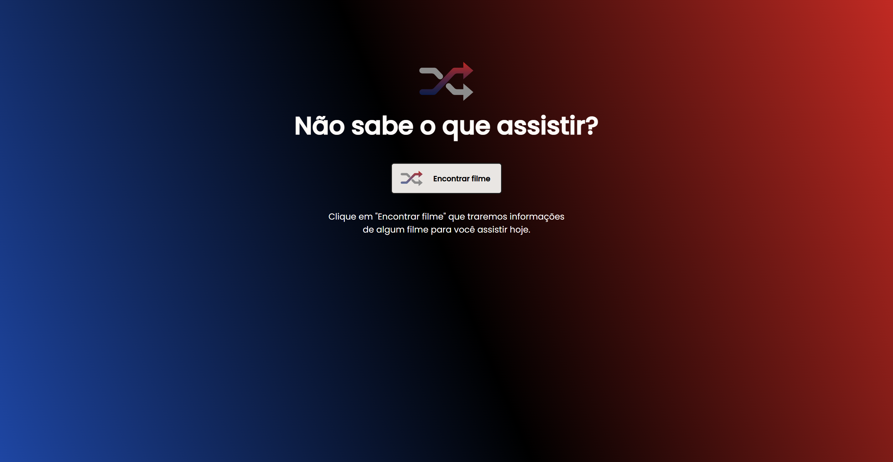

# Rocketseat

  Preview:
    &nbsp;&nbsp;&nbsp;
  <a href="./preview/425x626">
    425x626
  </a>
    &nbsp;&nbsp;&nbsp;|&nbsp;&nbsp;&nbsp;
  <a href="./preview/1440x747">
    1440x747
  </a>

## Projeto 💻
Projeto de um desafio da Rocketseat de utilizar a API do themoviedb.org para exibir um filme aleatório sempre que clicar em Encontrar Filme.

## Layout 🔖
Segue abaixo o layout deste projeto:
- [Figma](https://www.figma.com/file/9nvcogqpQrElMrrVPVKpyq/DD-%2F-Rocketflix-(Copy)?t=b0CUvR9nJRnUT9k8-6)

## Instalação 🛠
Siga esses passos para instalar o repositório na sua máquina:
1. Rode `git clone https://github.com/miishiyama/Rocketseat` para fazer um clone desse repositório.
2. Abra o arquivo HTML.

## Tecnologias 🚀
As tecnologias utilizadas neste projeto são:
- HTML
- CSS
- JavaScript
- DOM
- Media Queries
- Google Fonts
- Axios

## Créditos ❤️
Feito por [Millene Eduarda Ishiyama](https://github.com/miishiyama/).